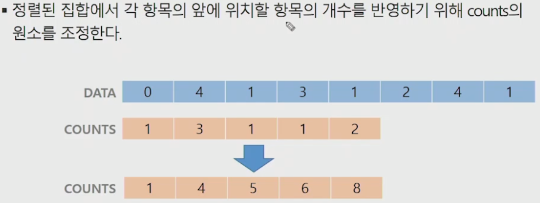

# 배열

## 배열이란 무엇인가

- 일정한 자료형의 변수들을 하나의 이름으로 열거하여 사용하는 자료구조

## 배열의 필요성

- 프로그램 내에서 여러 개의 변수가 필요할 때, 일일이 다른 변수명을 이용하여 자료에 접근하는 것은 매우 비효율적일 수 있다.
- 배열을 사용하면 하나의 선언을 통해서 둘 이상의 변수를 선언할 수 있다.
- 단순히 다수의 변수 선언을 의미하는 것이 아니라, 다수의 변수로는 하기 힘든 작업을 배열을 활용해 쉽게 할 수 있다.

## 1차원 배열

### 1차원 배열의 선언

- 별도의 선언 방법이 없으면 변수에 처음 값을 할당할 때 생성
- 이름: 프로그램에서 사용할 배열의 이름
- 1차원 배열 선언의 예
  - Arr = list()
  - Arr = []
  - Arr = [0] * 5

### 1차원 배열의 접근

- Arr[0] = 10; // '배열 Arr의 0번째 원소에 10을 저장하라'
- Arr[idx] = 20; // '배열 Arr의 idx번째 원소에 20을 저장하라'

## 정렬

- 2개 이상의 자료를 특정 기준에 의해 작은 값부터 큰 값(오름차순: ascending), 혹은 그 반대의 순서대로(내림차순: descending) 재배열하는 것
- 키: 자료를 정렬하는 기준이 되는 특정 값

### 정렬의 종류

- 대표적인 정렬 방식의 종류
  - 버블 정렬 (Bubble Sort)
  - 카운팅 정렬 (Counting Sort)
  - 선택 정렬 (Selection Sort)
  - 퀵 정렬 (Quick Sort)
  - 삽입 정렬 (Insertion Sort)
  - 병합 정렬 (Merge Sort)

### 정렬 알고리즘 비교

### 버블정렬

- 인접한 두 개의 원소를 비교하며 자리를 계속 교환하는 방식

- 정렬 과정

  - 첫 번째 원소부터 인접한 원소끼리 계속 자리를 교환하면서 맨 마지막 자리까지 이동한다.
  - 한 단계가 끝나면 가장 큰 원소가 마지막 자리로 정렬된다.
  - 교환하며 자리를 이동하는 모습이 물 위에 올라오는 거품 모양과 같다고 하여 버블 정렬이라고 한다.

  

  

  

  

- 시간 복잡도

  - O(n^2)

- 수도 코드

  

### 카운팅 정렬

- 항목들의 순서를 결정하기 위해 집합에 각 항목이 몇개씩 있는지 세는 작업을 하여, 선형 시간에 정렬하는 효율적인 알고리즘

- 제한 사항

  - 정수나 정수로 표현할 수 있는 자료에 대해서만 적용 가능: 각 항목의 발생 회수를 기록하기 위해, 정수 항목으로 인덱스 되는 카운트들의 배열을 사용하기 때문이다.
  - 카운트들을 위한 충분한 공간을 할당하려면 집합 내의 가장 큰 정수를 알아야 한다.

- 시간 복잡도

  - O(n + k): n은 리스트 길이, k는 정수의 최대값

- 정렬 과정

  

  

  

  

  

  

  

  

  

  

- 수도 코드

  

## 완전 검색(Exhaustive Search)

- 완전 검색 방법은 문제의 해법으로 생각할 수 있는 모든 경우의 수를 나열해보고 확인하는 기법이다.
- Brute-force 혹은 Generated-and-Test 기법이라고도 불리 운다.
- 모든 경우의 수를 테스트한 후, 최종 해법을 도출한다.
- 일반적으로 경우의 수가 상대적으로 작을 때 유용하다.
- 모든 경우의 수를 생성하고 테스트하기 때문에 수행 속도는 느리지만, 해답을 찾아내지 못할 확률이 작다.
- 자격검정평가 등에서 주어진 문제를 풀 때, 우선 완전 검색으로 접근하여 해답을 도출한 후, 성능 개선을 위해 다른 알고리즘을 사용하고 해답을 확인하는 것이 바람직하다.

## 순열(Permutation)

- 서로 다른 것들 중 몇 개를 뽑아서 한 줄로 나열하는 것

- 서로 다른 n개 중 r개를 택하는 순열은 아래와 같이 표현한다

  - nPr

- 그리고 nPr은 다음과 같은 식이 성립한다.

  - nPr = n * (n-1) * (n-2) * ... * (n-2+1)

- nPn = n!이라고 표기하며 Factorial이라 부른다.

  - n! = n * (n-1) * (n-2) * ... *2 * 1

- 예) {1, 2, 3}을 포함하는 모든 순열을 생성하는 함수

  

## 탐욕(Greedy) 알고리즘

- 탐욕 알고리즘은 최적해를 구하는데 사용되는 근시안적인 방법
- 여러 경우 중 하나를 결정해야 할 때마다 그 순간에 최적이라고 생각되는 것을 선택해나가는 방식으로 진행하여 최종적인 해답에 도달한다.

- 각 선택의 시점에서 이루어지는 결정은 지역적으로는 최적이지만, 그 선택들을 계속 수집하여 최종적인 해답을 만들었다고 하여, 그것이 최적이라는 보장은 없다.
- 일반적으로, 머릿속에 떠오르는 생각을 검증 없이 바로 구현하면 Greedy 접근이 된다.
- 동작 과정
  1) 해 선택: 현재 상태에서 부분 문제의 최적 해를 구한 뒤, 이를 부분해 집합(Solution Set)에 추가한다.
  2) 실행 가능성 검사: 새로운 부분해 집합이 실행 가능한지를 확인한다. 곧, 문제의 제약 조건을 위반하지 않는지를 검사한다.
  3) 해 검사: 새로운 부분해 집합이 문제의 해가 되는지를 확인한다. 아직 전체 문제의 해가 완성되지 않았다면 1)의 해 선택부터 다시 시작한다.

