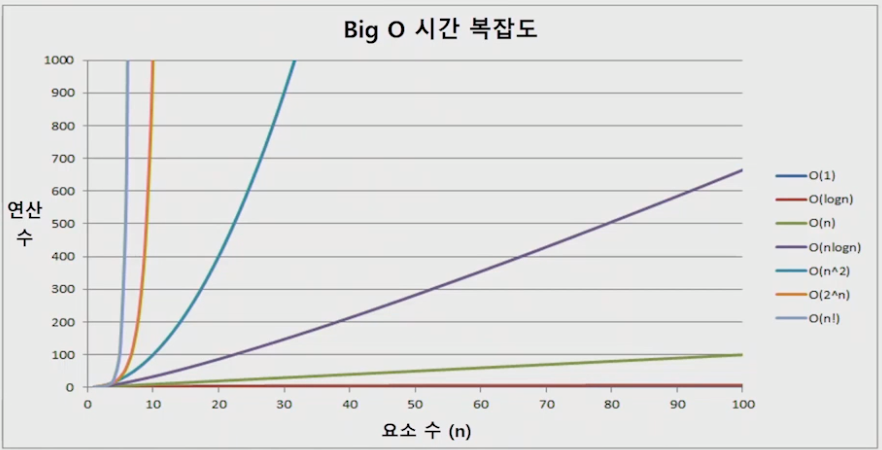

# 알고리즘

## 알고리즘

- 유한한 단계를 통해 문제를 해결하기 위한 절차나 방법이다. 주로 컴퓨터용어로 쓰이며, 컴퓨터가 어떤 일을 수행하기 위한 단계적 방법을 말한다.
- 간단하게 다시 말하면 어떠한 문제를 해결하기 위한 절차라고 볼 수 있다.

## 알고리즘의 성능

- 무엇이 좋은 알고리즘인가?
  - 정확성: 얼마나 정확하게 동작하는가
  - 작업량: 얼마나 적은 연산으로 원하는 결과를 얻어내는가
  - 메모리 사용량: 얼마나 적은 메모리를 사용하는가
  - 단순성: 얼마나 단순한가
  - 최적성: 더 이상 개선할 여지없이 최적화되었는가

## 시간복잡도

- 알고리즘의 작업량을 표현할 때 시간복잡도로 표현한다.
- 시간 복잡도(Time Complexity)
  - 실제 걸리는 시간을 측정
  - 실행되는 명령문의 개수를 계산

- 시간 복잡도 => 빅-오(O) 표기법

  - 빅-오 표기법(Big-Oh Notation)

  - 시간 복잡도 함수 중에서 가장 큰 영향력을 주는 n에 대한 항만을 표시

  - 계수(Coefficient)는 생략하여 표시

  - 예를 들어

    

  - n개의 데이터를 입력 받아 저장한 후 각 데이터에 1씩 증가시킨 후 각 데이터를 화면에 출력하는 알고리즘의 시간복잡도는 어떻게 되나?

    - O(n)

## 다양한 시간복잡도의 비교

- 요소 수가 증가함에 따라 각기 다른 시간 복잡도의 알고리즘은 아래와 같은 연산 수를 보인다.

  

